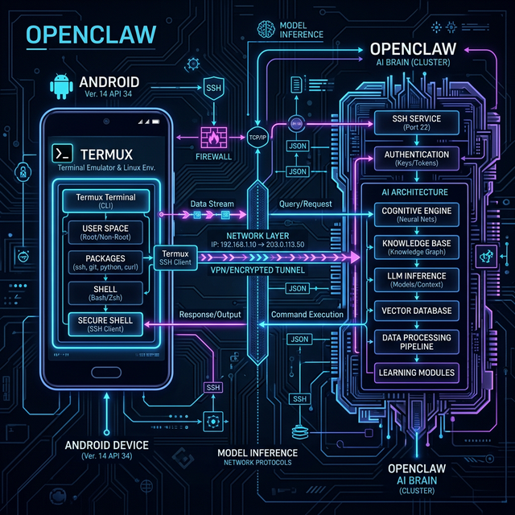

<div align="center">
  

  <h1 align="center">OpenClaw on Android (OCA)</h1>

  <p align="center">
    <b>Turn any Android phone into a 24/7 AI server — one command, zero hassle.</b><br/>
    Native performance via Termux & glibc without Proot overhead.
  </p>

  <p align="center">
    <a href="https://github.com/PsProsen-Dev/OpenClaw-On-Android/releases">
      
    </a>
    <a href="https://github.com/PsProsen-Dev/OpenClaw-On-Android/blob/main/LICENSE">
      
    </a>
    <a href="https://github.com/PsProsen-Dev/OpenClaw-On-Android/discussions">
      
    </a>
  </p>

  <p align="center">
    <a href="#-quick-start">Quick Start</a> •
    <a href="#-features">Features</a> •
    <a href="#-documentation">Documentation</a> •
    <a href="https://deepwiki.com/PsProsen-Dev/OpenClaw-On-Android">DeepWiki</a> •
    <a href="#-project-architecture">Architecture</a> •
    <a href="#-community">Community</a>
  </p>
</div>

<br/>

## 🌟 The Vision

Your old Android phone? It's a powerful ARM server waiting to happen. OCA seamlessly installs the **OpenClaw** AI ecosystem directly onto your device via Termux. This completely bypasses sluggish Linux distributions (like Ubuntu on Proot), running natively with full `glibc` compatibility instead of Android's default Bionic libraries.

---

## 🚀 Quick Start

Deploying OCA takes under 2 minutes. Launch **Termux** (from F-Droid) and execute:

```bash
curl -sL https://raw.githubusercontent.com/PsProsen-Dev/OpenClaw-On-Android/master/bootstrap.sh | bash && source ~/.bashrc
```

The installer dynamically patches the environment and prompts you for optional integrations like **Termux:API**, **Termux:Boot**, and the **Qwen Code CLI**.

---

## ⚡ Features

- **📱 Natively executed AI Gateway**: OpenClaw runs bare-metal in Termux.
- **☁️ Full Node.js v24 Environment**: A completely independent `glibc` patched binary setup (bypassing `/system/lib64`).
- **🤖 Built-in AI CLIs**: Zero-config prompts for _Qwen Code_, _Claude Code_, _Gemini_, and _Codex_.
- **🌐 Remote Setup**: Out-of-the-box SSH Server integration (Port 8022).
- **🛡️ Safe Root Support**: `oca-root` wrapper selectively executes root commands without compromising the Android system.
- **🔄 Auto-Updates**: Keep the stack updated natively via `oca --update`.

---

## 🏗 Project Architecture

<div align="center">
  
</div>

The OCA wrapper bridges the Android operating system and the Linux toolchain:
1. **Pacman `glibc-runner`**: Injects `ld-linux-aarch64.so.1` to bypass Android's restricted linker.
2. **Path Rewriting**: Standard UNIX paths (`/tmp`, `/bin/sh`) are dynamically mapped to Termux prefixes.
3. **JS Runtime Shims**: `os.cpus()` and `os.networkInterfaces()` are polyfilled via `glibc-compat.js` to prevent V8 engine panics on restricted Android kernels.

---

## 📖 Documentation

All official documentation is available below for a first-class reading experience.

👉 **[Read the Full OCA Docs](docs/)**

- [Installation Guide](docs/installation.mdx)
- [Managing Configuration](docs/configuration.mdx)
- [Troubleshooting & Fixes](docs/troubleshooting.mdx)
- [SSH Remote Setup](docs/ssh-guide.mdx)

### 🛑 Important: Android 12+ Phantom Process Killer
If your device crashes with `[Process completed (signal 9)]`, Android's aggressive battery saving has killed Termux. You must disable this via ADB: [Read the Phantom Process Fix Guide](docs/disable-phantom-process-killer.mdx).


## 🤝 Community

Join the discussion! Ask questions, share your Android setup, or request features in our GitHub community space.

- 💬 **[GitHub Discussions](https://github.com/PsProsen-Dev/OpenClaw-On-Android/discussions)**
- 🐛 **[Report an Issue](https://github.com/PsProsen-Dev/OpenClaw-On-Android/issues)**

---

## 🙏 Credits & License

Built with extreme precision by **[PsProsen-Dev](https://github.com/PsProsen-Dev)** using _Jarvis (RTX⚡) / OpenClaw Authored Architecture_.  

<div align="center">
  Released under the <a href="LICENSE">MIT License</a>.
</div>
